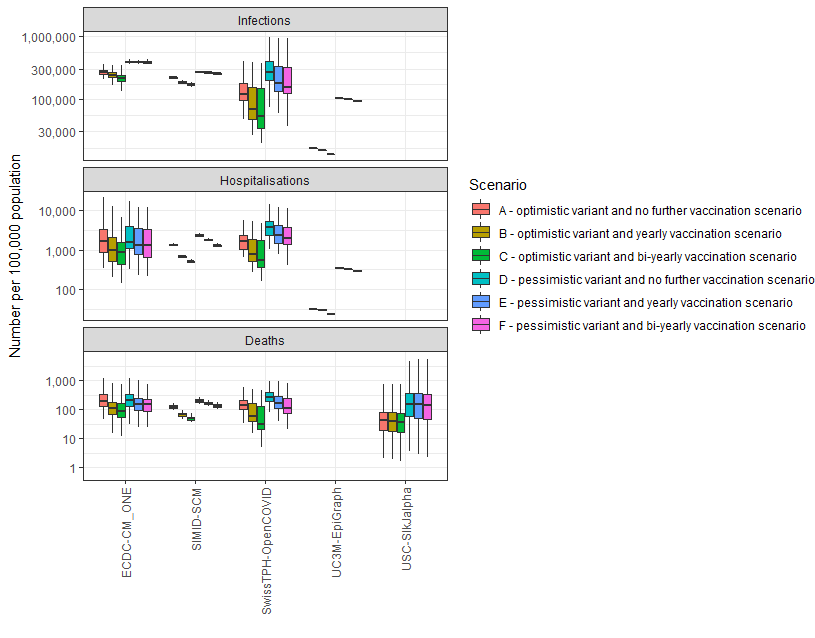

```{r setup, include = FALSE}
# Settings
knitr::opts_chunk$set(eval = TRUE, echo = FALSE, 
                      message = FALSE, warning = FALSE)
knitr::knit_hooks$set(fig.width = knitr::hook_pngquant)
```

```{r prep}
# Packages
library(knitr)
source("code/load/scenarios.R")
round_text <- paste0("round-", params$round)
```

# Scenarios

```{r describe-scenario, results = 'asis'}
cat(scenarios[[round_text]][["table"]])
```

See also the [full scenario details](`r paste0("https://github.com/covid19-forecast-hub-europe/covid19-scenario-hub-europe/wiki/Round-", params$round)`) for more detail on the common set of assumptions teams used to create their models.

In Round `r params$round`, we asked modellers to start their projections from the `r scenarios[[round_text]][["origin_date"]]`. Data after this date were not included, and as a result, model projections are unlikely to fully account for later information on the changing variants or behavioural patterns.


# Shared assumptions
- We ask all modellers to include the following parameters:
- Vaccination as planned includes a full primary schedule and 2 booster doses
- Vaccination uptake is higher in 60+ than <60 age groups (for example, 75% / 15% respectively)
- There is sufficient vaccine supply
- One new variant every 9 months
- First introduction of a new variant: 1st October 2022
- At start date, assume 0.1% of infections/cases due to new variant (at minimum 1 infection)
- After that it should not drop below 0.1%, until the next variant arrives
- The basic reproduction number R0, or the inherent transmissibility of variants, is constant
- The inherent severity of variants is constant
- Vaccine effectiveness against a variant that seeded >6 months age is assumed not to be affected by immune escape (from the variant that seeded >6 months ago). This resembles updated vaccine formulations
- The same immunity of a variant induced against reinfection with same variant; variant immune escape is the same towards all other previous variants
- No new public health and social measures (non-pharmaceutical interventions / NPIs)
- No changes in demography
- No novel drugs that strongly impact burden

# Round 3 submissions
Round 3 has received submissions from six international modelling teams across EU/EEA and beyond: Two teams submitted for 29 EU/EEA countries (not LI due to small numbers in the input data), one team submitted for twelve EU/EEA countries, and three teams submitted for one EU/EEA country. These submissions include five model submissions for infections and deaths, one model submission for cases, and five model submissions for hospitalisation projections.

Table 1. Participating teams by number of countries, scenarios, samples and time horizon

| Team | Countries | Scenario    | Samples | Weeks |
| :--- | :---: |  :---: | :---: | :---: |
| USC-SIkJalpha | 29 | 6 | 96 | 156 |
| ECDC-CM_ONE | 29 | 6 | 20 | 259 |
| SwissTPH-OpenCOVID | 12 | 6 | 100 | 260 |
| SIMID-SCM | 1 | 6 | 100 |  522 |
| UC3M-EpiGraph | 1 | 6 | 6 | 524 |
| MOCOS | 1 | 3 | 100 | 121 |


Table 2. Number of independent model projections/samples for each target variable

| Team      | Infections | Cases    | Hospitalistions | Deaths |
| :---        |    :---:   | :---: | :---: | :---: |
| USC-SIkJalpha      | 0 | 96   | 0 | 96 |
| ECDC-CM_ONE   | 20        | 0      | 20 | 20 |
| SwissTPH-OpenCOVID   | 100        | 0   | 100 | 100 |
| SIMID-SCM   | 100        | 0     | 100 |  100 |
| UC3M-EpiGraph   | 6        | 0      | 6 | 0 |
| MOCOS   | 100        | 0     | 100 | 100 |


In this report we only show results from models that provided projections for all 6 scenarios (A-F), and for the three common outcomes of infections, hospitalisations and deaths.


# Results

## Cumulative outcomes in the next three years per 100,000 population
For each model and scenario, we compare the cumulative number of the three outcomes (infections, hospitalisations, and deaths) for the next three years. The results for each model are aggregated across all countries as well as across samples from the random distributions that describe uncertain parameters. 

Figure 1 below shows that, for any given scenario, all three outcomes across different models are relatively consistent, including hospitalisation and death projections, which often include the highest level of variation across different models due to different assumptions (including the protection of vaccinations and prior infection, the speed of the waning of protection, etc). The ranking of scenarios A-C over D-F is also highlighting the differences in outcomes expected for the optimistic vs pessimistic variant, and the results show how the vaccination programmes reduce the burden compared to a scenario with no further vaccination. 



## Number of infections in the next three years over different age groups
We evaluated the average cumulative number of infections per individual person in three different age groups (aged <18 years, 18-59 years, and 60+ years) over the next three years for the different models and scenarios. 
Figure 2 below shows that the largest risk of (re-)infection lies in the population younger than 60 years old, with multiple infections expected over the three-year period in most models and scenarios. The boxplots show the variation across different countries and samples from the random distributions that describe uncertain parameters. This risk is decreased with vaccination campaigns. Moreover, scenarios with the pessimistic variant introduction (D-F) generally lead to higher numbers of (re-)infections  than the optimistic variant scenarios (A-C). 


## Relative impact of vaccination campaigns over the next three years
For each outcome, model and scenario, we evaluate the proportion of averted outcomes due to the vaccination campaigns (scenarios B-C and E-F). The cumulative outcome is compared between baseline scenario A (or D) and the corresponding vaccination campaign scenarios B and C (or E and F). The results are aggregated across different countries.
Figure 3 below shows that the largest impact of vaccination programmes is seen for severe outcomes (hospitalisations and deaths), with the scenarios of the bi-yearly vaccination programmes (C and F) achieving the largest reduction in outcomes. Out of all three outcomes, the predicted number of infections varies the most across models and scenarios (see also Figure 1), which is also due to summarising the outcomes of models for different countries, and this translates also in the averted number of infections here. Results are more aligning for the severe outcomes of hospitalisations and deaths (both in Figure 1 and Figure 3 below).


