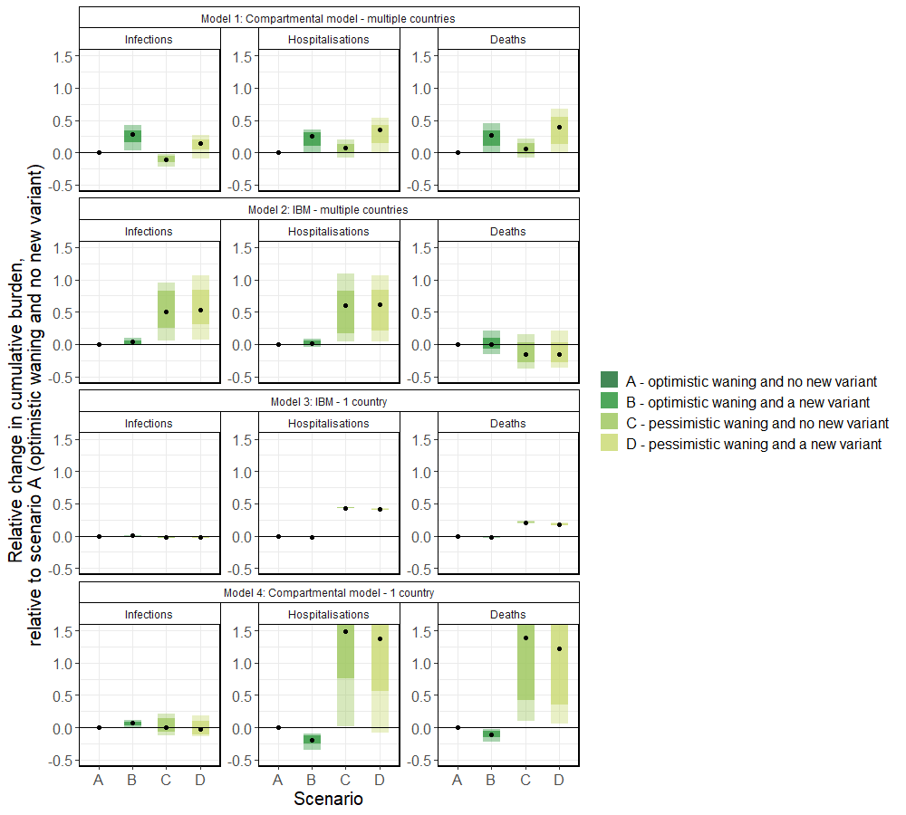

  ```{r setup, include = FALSE}
# Settings
knitr::opts_chunk$set(eval = TRUE, echo = FALSE,
                      message = FALSE, warning = FALSE)
knitr::knit_hooks$set(fig.width = knitr::hook_pngquant)
```

```{r prep}
# Packages
library(knitr)
source("code/load/scenarios.R")
round_text <- paste0("round-", params$round)
```

# Scenarios

```{r describe-scenario, results = 'asis'}
cat(scenarios[[round_text]][["table"]])
```

See also the [full scenario details](`r paste0("https://github.com/covid19-forecast-hub-europe/covid19-scenario-hub-europe/wiki/Round-", params$round)`) for more detail on the common set of assumptions teams used to create their models.

In Round `r params$round`, we asked modellers to start their projections from the `r scenarios[[round_text]][["origin_date"]]`. Data after this date were not included, and as a result, model projections are unlikely to fully account for later information on, for example, the changing variant landscape or behavioural patterns. 


# Shared assumptions
We asked all modellers to include the following parameters and assumptions:

  - Protection against infection was assumed to decrease to 70% (or 40%) of the initial immunity after 6 months in the optimistic (or pessimistic) waning scenario, respectively.
- Protection against severe outcome was assumed to not decrease (or to decrease to 80%) of the initial immunity after 6 months in the optimistic (or pessimistic) waning scenario, respectively.
- There is sufficient vaccine supply.
- The parameters for the waning speed of protection related to the waning since the most recent vaccination or infection.
- We assumed no plateau for existing immunity against infection.
- Over the whole projected time period, one new variant was introduced on 01 May 2023.
- We asked teams to assume that at least 0.1% of infections/cases were due to the new variant on the day of introduction. After the day of the introduction, we asked teams that this number should not drop below 0.1% for at least 16 weeks.
- We assumed that  the inherent transmissibility of variants does not change over time.
- The inherent severity of the new variant was assumed to not change over time.
- No new public health and social measures (non-pharmaceutical interventions / NPIs) would be introduced.
- No changes in demography given the short timeframe.
- No novel drugs that strongly impact burden or transmission.
- No new vaccination campaigns, and the vaccination uptake continues with the current trends.

# Assumptions left to modeller judgement
Modellers should use their own judgement and relevant literature if making assumptions about a number of aspects. Note that the resulting between-team differences in these assumptions are mean to reflect the uncertainty regarding these aspects and they are main contributor to the uncertainty in the analysis results. 

- Item 1
- Item 2


# Round 5 submissions
Round 5 has received submissions from six international modelling teams across the EU/EEA and beyond: Two teams submitted for 30 EU/EEA countries, and three teams submitted for one EU/EEA country. These submissions include four model submissions for infections, and five model submissions for hospitalisation and death projections.

Table 1. Participating teams by number of countries, scenarios, samples and time horizon

| Team | Countries | Scenario    | Samples |  By age |
  | :--- | :---: |  :---: | :---: | :---: |
  | ECDC-CM_TWO | 24 | 4 | 100 |  Yes |
  | SwissTPH-OpenCOVID | 11 | 4 | 10 | Yes |
  | SIMID-SCM | 1 | 4 | 100 |  Yes |
  | UC3M-EpiGraph | 1 | 4 | 30 |  Yes |
  | ICM | 1 | 4 | 64 | Yes |


# Results

For each model and scenario, we evaluated the proportion of the three outcomes (deaths, hospitalisations, infections), that is due to a new variant and/or faster (i.e., pessimistic) waning. The cumulative outcomes were compared between baseline scenario A and the other scenarios. The results were aggregated across different countries. Figure 1 below shows that pessimistic waning (scenario C) in most models and outcomes leads to a substantial increase in cumulative burden compared to optimistic waning (scenario A). The introduction of a new variant also showed a substantial impact on the cumulative burden (i.e., comparing scenarios A and B, or C and D) across most models and outcomes. There is a substantial variation in precise values between different models, which is partly due to variation between models, model assumptions, as well as aggregation across different countries (see Table 1 above to see number of countries modelled by each model). Please note these scenarios have not explored the impact of future vaccination campaigns and thus cannot be used to estimate the impact of vaccination. We plan to explore this in the future scenario rounds.



_Figure 1: Relative change in cumulative infections (left), hospitalisations (middle) and deaths (right) across scenarios, relative to scenario A. The light and dark boxes show the  80% and 50% quantiles, respectively, and the black dot shows the median across samples and countries. The four scenarios are: (A) optimistic waning and no new variant, (B) optimistic waning and a new variant, (C) pessimistic waning and no new variant,  (D) pessimistic waning and a new variant. One model was excluded from the figure due to the low estimated number of severe outcomes in scenarios A&B. Note that we truncate the y-axis at (-0.5, 1.5)._


# Observations

Some models use local (country provided) data sources which can result in their model projections to vary both in past and current values as well as projected trends. Further harmonisation of input data and calibration periods can help with reducing the variation between models. Some teams also have experienced difficulties in calibrating the models.


Update 19/06/2023: Clarified that vaccination was not explicitly modelled in this scenario round, and the results shown here cannot be directly interpreted for future vaccination campaigns.

Update 20/06/2023: Updated Figure 1 with new Model 4 results which corrected for minor issues related to calibration of the pessistic waning scenarios.
